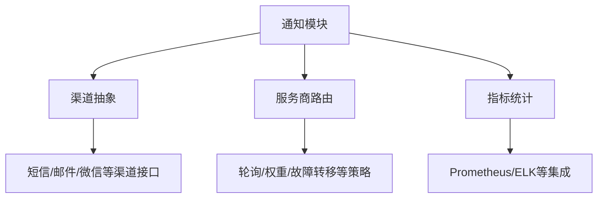

# 通知模块

```text
代码结构方面，可能需要以下包结构： 
- channel：存放各渠道接口和实现 
- provider：各服务商的实现 
- strategy：服务商选择策略 
- stats：统计指标处理 
- model：数据模型，如通知、消息等
```


```mermaid
graph TD
    A[通知模块] --> B[渠道抽象]
    A --> C[服务商路由]
    A --> D[指标统计]
    B --> E[短信/邮件/微信等渠道接口]
    C --> F[轮询/权重/故障转移等策略]
    D --> G[Prometheus/ELK等集成]
```